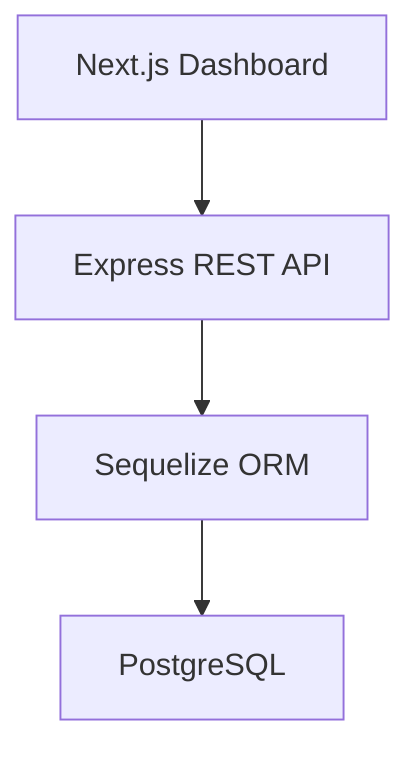

# Employability Platform

A full-stack platform for managing job vacancies and candidate applications.

The project demonstrates REST API design, authentication, role-based workflows, relational data modeling, API documentation, and containerized local development.

## Highlights

- Vacancy creation and management.
- Candidate registration and application workflows.
- Role-oriented experiences for administrators, managers, and coders.
- JWT authentication combined with API key validation.
- PostgreSQL persistence through Sequelize.
- Interactive Swagger / OpenAPI documentation.
- Next.js dashboard for testing the complete application flow.
- Docker Compose environment for the API and database.

## Architecture



## Technology stack

| Area | Technologies |
| --- | --- |
| Backend | Node.js, Express, TypeScript |
| Frontend | Next.js 14, React 18, TypeScript |
| Database | PostgreSQL, Sequelize |
| Security | JWT, refresh tokens, API key, bcrypt |
| Documentation | Swagger / OpenAPI |
| Infrastructure | Docker, Docker Compose |

## Run with Docker

### Prerequisites

- Docker Desktop
- Docker Compose

```bash
git clone https://github.com/LuisDa87/Empleabilidad.git
cd Empleabilidad
docker compose up -d
```

Available services:

- API: `http://localhost:3000`
- Swagger: `http://localhost:3000/docs`
- Frontend: `http://localhost:3001`
- PostgreSQL: `localhost:5433`

View API logs:

```bash
docker compose logs -f api
```

## Run the backend locally

```bash
npm install
cp .env.example .env
npm run db:sync
npm run seed
npm run dev
```

## Run the frontend locally

```bash
cd frontend
npm install
npm run dev
```

## Local demo access

The seed command creates development-only accounts for the supported roles. Their credentials and the local API key are documented for local testing only and must never be reused in production.

Protected endpoints require:

```http
Authorization: Bearer <access-token>
x-api-key: <local-api-key>
```

## Backend scripts

- `npm run dev`: starts the API in development mode.
- `npm run build`: compiles TypeScript into `dist/`.
- `npm start`: runs the compiled API.
- `npm run db:sync`: synchronizes the development database.
- `npm run seed`: creates sample users and vacancies.

## Portfolio relevance

This project showcases a complete product flow across frontend, backend, security, database, and local infrastructure. It is intended as a technical portfolio project and uses development-only sample data.

## Author

**Luis David Ducuara Cadavid**  
Backend & Automation Developer · Mechatronics Engineering Student  
[GitHub](https://github.com/LuisDa87) · [LinkedIn](https://www.linkedin.com/in/luisdavidd/)
